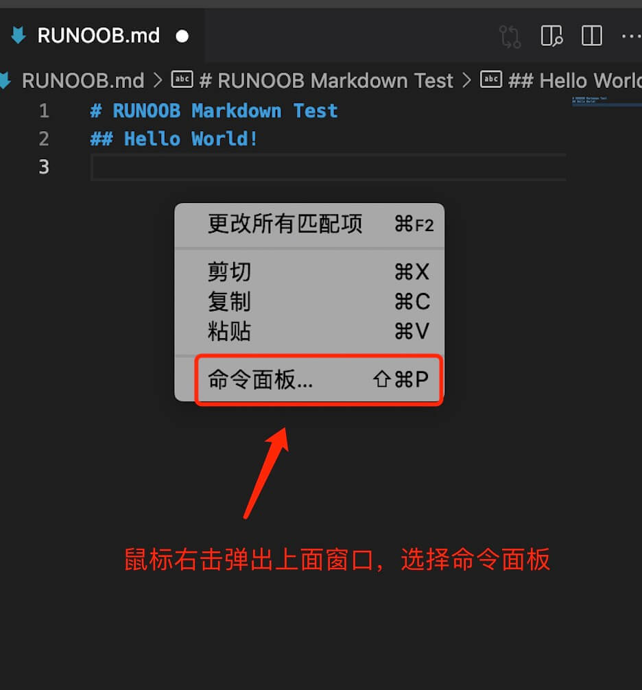
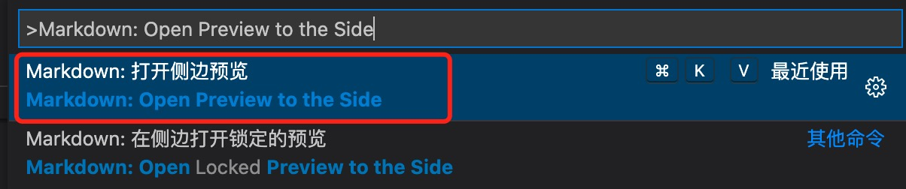
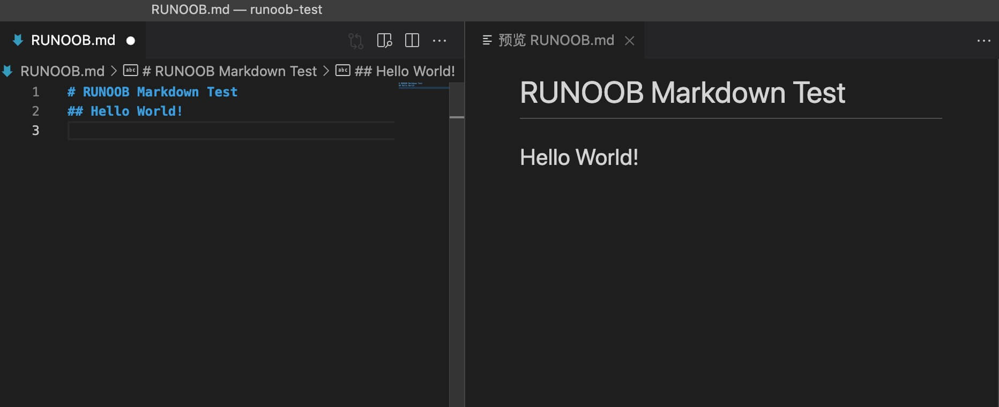
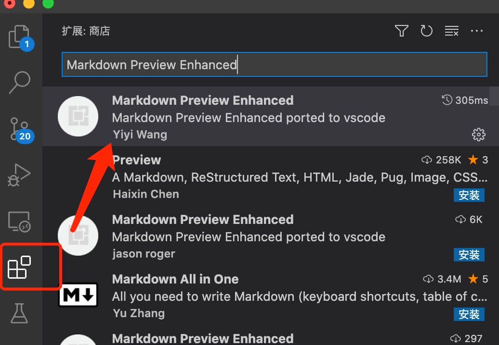
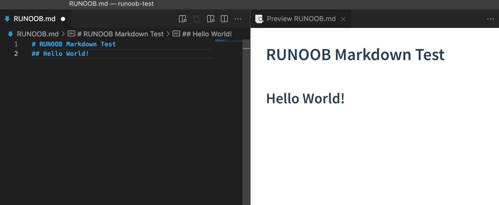
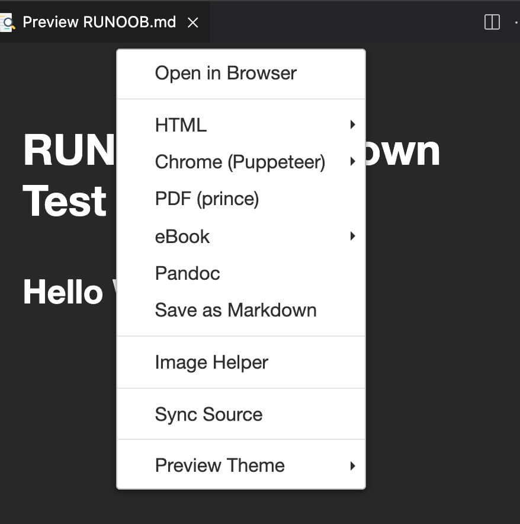

# Markdown 教程

Markdown 是一种轻量级标记语言，它允许人们使用易读易写的纯文本格式编写文档。
Markdown 语言在 2004 由约翰·格鲁伯（英语：John Gruber）创建。
Markdown 编写的文档可以导出 HTML 、Word、图像、PDF、Epub 等多种格式的文档。
Markdown 编写的文档后缀为 **.md, .markdown**。
- - - 

## Markdown 应用
Markdown 能被使用来撰写电子书，如：Gitbook。
当前许多网站都广泛使用 Markdown 来撰写帮助文档或是用于论坛上发表消息。例如：GitHub、简书、reddit、Diaspora、Stack Exchange、OpenStreetMap 、SourceForge等。
- - -
## 编辑器
本教程将使用 VSCode 编辑器来讲解 Markdown 的语法，VSCode 支持 MacOS 、Windows、Linux 平台，且包含多种主题。
VSCode 默认集成了 Markdown 文档编辑插件，原生就支持高亮 Markdown 的语法。
VSCode（全称：Visual Studio Code）是一款由微软开发且跨平台的免费源代码编辑器。
* VScode 安装教程：[https://www.runoob.com/w3cnote/vscode-tutorial.html](https://www.runoob.com/w3cnote/vscode-tutorial.html)
* VScode 官网地址：[https://code.visualstudio.com/](https://code.visualstudio.com/)



VSCode 实时预览还需要执行 Markdown: Open Preview to the Side 命令来实现。
在命令窗口输入 Markdown: Open Preview to the Side 命令：


最终效果：

如果你需要将 markdown 转为 PDF、图片、HTML 等格式也可以安装对应的插件来实现。
你也可以使用我们的在线编辑器来测试：[https://c.runoob.com/front-end/712](https://c.runoob.com/front-end/712)

- - -
## 测试实例
接下来的测试中，我们先在 VSCode 下安装 **Markdown Preview Enhanced** 插件来实现更强大的功能。
点击右侧栏扩展按钮，查找**Markdown Preview Enhanced** 插件，点击安装：

安装完成后重启 VSCode。

在 RUNOOB.md 输入以下代码：
```
# RUNOOB Markdown Test
## Hello World!
```

将该代码格式粘贴到文件 RUNOOB.md 上，效果如下：



在预览框中右击鼠标还提供了各种导出功能：


- - -

## 有用的书籍

《了不起的Markdown》：

* [京东](https://item.jd.com/12669274.html)
* [当当](http://product.dangdang.com/27912444.html)